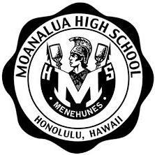

## Project Information
The Corponector web application is an application designed to bridge the gap between students at the University of Hawaii (UH) and companies seeking to recruit talent. The application aims to streamline the recruitment process by allowing companies to showcase their job opportunities and recruit students with the necessary skills and interests. Simultaneously, it enables students to create detailed profiles highlighting their skills, preferences, and career goals, thereby matching them with potential employers who are looking for candidates with similar qualifications. This essay will outline the core features, technologies, goals, and user roles that make the Corponector web application a powerful tool for both students and employers.

The Corponector platform is being built using modern web development technologies to ensure a smooth and efficient user experience. The core technologies include React, Next.js, and PostgreSQL. React is used to implement the platform’s component-based user interface (UI) and routing system, ensuring that the application is dynamic and responsive. Next.js is chosen to enhance the development process, particularly for full-stack applications, offering powerful features such as server-side rendering (SSR), static site generation (SSG), and API routes. These features are crucial for creating a fast, SEO-friendly, and scalable application. The use of PostgreSQL, a relational database, ensures the platform can handle structured data with complex relationships between entities, such as students, companies, job opportunities, and profiles.  The ultimate goal of the Corponector project is to facilitate connections between students and companies while enhancing job visibility and streamlining recruitment. The platform is designed to achieve several key objectives:

## My contribution
I was responsible of the Company Home Page where it allows companies to manage their job postings and view candidates who match their required skills and location preferences. Companies can list their availbale job listings, and track engagement with student profiles to find the best talent for their positions.

This homepage showcases the company’s details, including an overview, location, job postings, and key contact information. Companies can update their profile, manage available positions, and track engagement with student applicants to attract the right talent.

## My experience
My experience working on the Corponector web application has been incredibly rewarding, especially when creating the company homepage. I thoroughly enjoyed designing this section as it allowed me to combine both functionality and aesthetics to create a user-friendly interface. The company homepage serves as a crucial feature, giving businesses a space to showcase their mission, available positions, and recruitment needs. I took great care in ensuring that the page was intuitive, easy to navigate, and visually appealing. Overall, this experience not only enhanced my technical skills but also gave me a deeper appreciation for designing web pages that serve real-world purposes and make a tangible impact on users.
